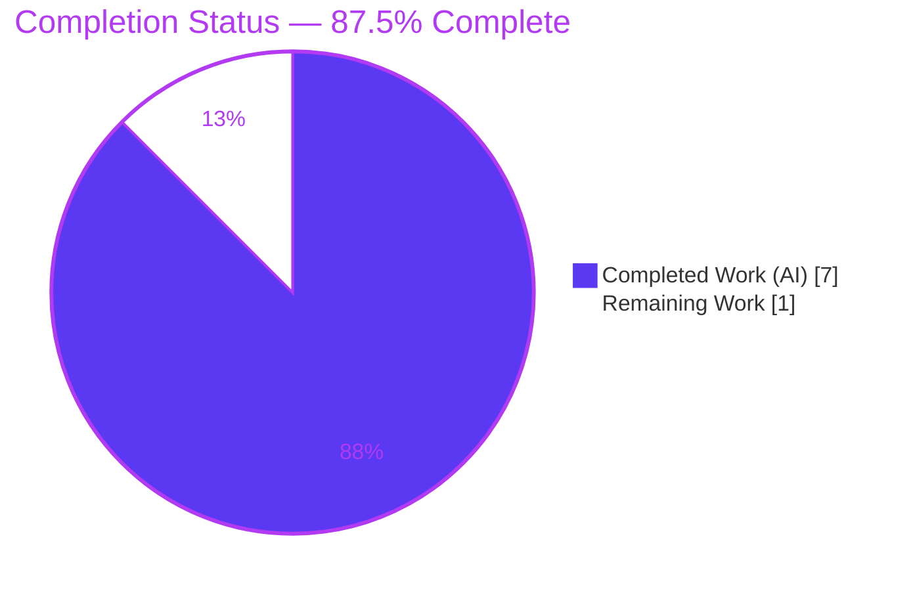
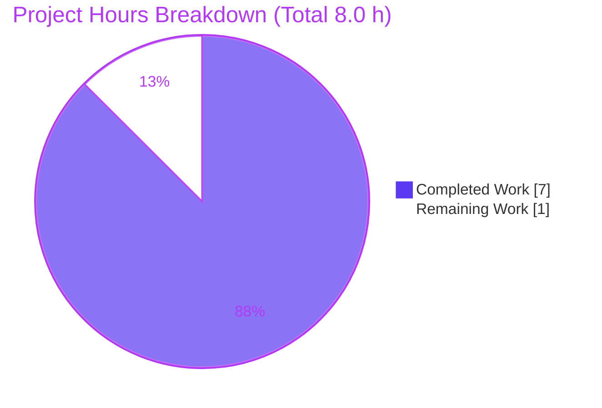
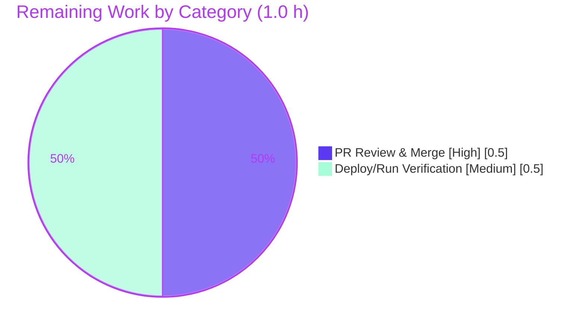

# Blitzy Project Guide — 14April_123 (Node.js + Express.js Tutorial Server)

> **Brand legend:** Completed / AI Work = Dark Blue `#5B39F3` · Remaining / Not Completed = White `#FFFFFF` · Headings / Accents = Violet-Black `#B23AF2` · Highlight = Mint `#A8FDD9`

---

## 1. Executive Summary

### 1.1 Project Overview

`14April_123` is a minimal Node.js HTTP server that adopts the **Express.js** web framework and exposes two plain-text `GET` endpoints: `GET /` returns **"Hello world"** and `GET /evening` returns **"Good evening"**. The work was modeled as a framework-migration refactor (native `http` idioms → Express.js) plus an additive second endpoint. The target audience is developers following a tutorial; the technical scope is a single CommonJS entry module (`server.js`), an npm manifest and lockfile, a `.gitignore`, and updated documentation. Business impact is educational/foundational — it establishes an idiomatic Express baseline that can grow into a routed application later.

### 1.2 Completion Status



**Completion: 87.5%** — calculated per PA1 as `Completed Hours ÷ Total Hours = 7.0 ÷ 8.0 = 87.5%`.

| Metric | Hours |
|--------|-------|
| **Total Hours** | **8.0** |
| Completed Hours (AI + Manual) | 7.0 (7.0 AI / 0.0 Manual) |
| Remaining Hours | 1.0 |

> All 12 AAP-specified requirements are **100% complete and validated**. The remaining 1.0 h is the human-in-the-loop path-to-production gate (PR review/merge + post-merge deploy verification). Per Blitzy policy, completion is capped below 100% pending human review.

### 1.3 Key Accomplishments

- ✅ Adopted **Express.js 5.2.1** as the HTTP server foundation (`express()` + `app.get()` + `res.send()`), replacing native `http` idioms.
- ✅ Preserved the existing response contract exactly: `GET /` → **"Hello world"** (11 bytes).
- ✅ Delivered the net-new endpoint: `GET /evening` → **"Good evening"** (12 bytes).
- ✅ Declared `express` (`^5.1.0`) in `package.json` and locked the full 66-package tree in `package-lock.json` (`lockfileVersion 3`).
- ✅ Single conventional start command (`npm start` → `node server.js`) binding port `3000`.
- ✅ `.gitignore` excludes `node_modules/`; comprehensive `README.md` (H1 preserved + install/run/endpoints).
- ✅ Independently re-validated all five production-readiness gates: install (0 vulnerabilities), compilation, runtime, endpoint byte-assertions, edge cases (404 / auto-HEAD).

### 1.4 Critical Unresolved Issues

| Issue | Impact | Owner | ETA |
|-------|--------|-------|-----|
| _None_ — zero unresolved blockers. All AAP gates passed; working tree clean. | None | — | — |

> No compilation errors, runtime errors, dependency vulnerabilities, or failing tests were found. The only outstanding work is the standard human review/merge gate (see 1.6 / Section 2.2).

### 1.5 Access Issues

| System/Resource | Type of Access | Issue Description | Resolution Status | Owner |
|-----------------|----------------|-------------------|-------------------|-------|
| _None identified_ | — | Repository accessible; npm registry reachable (validated); no credentials/secrets/API keys required (static-string endpoints, no external services or datastores). | N/A | — |

**No access issues identified.**

### 1.6 Recommended Next Steps

1. **[High]** Review the PR diff (5 files: `server.js`, `package.json`, `package-lock.json`, `.gitignore`, `README.md`) and merge the branch into `main`.
2. **[Medium]** Run post-merge deploy/run verification on the target host: `npm ci && npm start`, then `curl` both endpoints to confirm exact responses.
3. **[Low]** (Optional) Apply AAP 0.6.2 hardening — `app.disable('x-powered-by')` — if framework fingerprinting is a concern.
4. **[Low]** (Optional) Add `process.env.PORT` fallback and an `engines`/`.nvmrc` Node ≥ 18 pin for deployment portability.
5. **[Low]** (Optional) If the project grows beyond a tutorial, add automated tests (Jest + Supertest), a `/health` endpoint, and a process manager/container.

---

## 2. Project Hours Breakdown

### 2.1 Completed Work Detail

| Component | Hours | Description |
|-----------|-------|-------------|
| `server.js` — Express application | 2.0 | `'use strict'` CommonJS entry; `require('express')`, `app = express()`, `app.get('/', …res.send('Hello world'))`, `app.get('/evening', …res.send('Good evening'))`, `app.listen(3000, …log)`. Native `http` → Express migration design; full inline documentation. (AAP R1, R6–R8, R10) |
| `package.json` — npm manifest | 0.5 | `name`, `version 1.0.0`, `description`, `main server.js`, `scripts.start "node server.js"`, `license ISC`, `dependencies.express ^5.1.0`. (AAP R2, R9, R11) |
| `package-lock.json` + dependency install | 0.75 | `npm install` to generate `lockfileVersion 3`; pins `express 5.2.1` + 65-package transitive tree (66 total); `package.json ↔ lock` sync verification. (AAP R3, R11) |
| `.gitignore` | 0.25 | Single entry `node_modules/` to keep installed dependencies out of version control. (AAP R4) |
| `README.md` — documentation | 1.0 | H1 `# 14April_123` preserved; added description, prerequisites (Node ≥ 18), install (`npm install`), run (`npm start`), startup-log block, endpoint table, curl examples. (AAP R5) |
| Express framework research & version confirmation | 0.5 | Confirmed Express `5.2.1` is current and Node.js ≥ 18 is required, ensuring a valid pinned version. (AAP R12) |
| Validation & QA — 5 production-readiness gates | 2.0 | Dependency install/audit (0 vulns), compilation (`node --check`), runtime startup, endpoint byte-assertions (11/12 bytes), header + 404/auto-HEAD edge-case checks. |
| **Total Completed** | **7.0** | All values trace to AAP-specified deliverables and their validation. |

> **Validation:** Total of the Hours column = **7.0 h**, matching Completed Hours in Section 1.2.

### 2.2 Remaining Work Detail

| Category | Hours | Priority |
|----------|-------|----------|
| Human PR code review & merge branch → `main` (path-to-production) | 0.5 | High |
| Post-merge deployment/run verification on target host (`npm ci && npm start`; curl both endpoints) | 0.5 | Medium |
| **Total Remaining** | **1.0** | — |

> **Validation:** Total = **1.0 h**, matching Remaining Hours in Section 1.2 and the "Remaining Work" value in the Section 7 pie chart. Section 2.1 (7.0) + Section 2.2 (1.0) = **8.0 h** Total.
>
> **Out of scope (excluded from the hours above per AAP 0.2.2):** automated test suites, CI/CD, containers, databases, auth, `.env`, UI, TypeScript/bundlers/linters, and any endpoints beyond the two `GET` routes. These are tracked as optional future-work in Section 8, not as remaining hours.

### 2.3 Hours Calculation Summary

```
Completed Hours = 2.0 + 0.5 + 0.75 + 0.25 + 1.0 + 0.5 + 2.0 = 7.0 h
Remaining Hours = 0.5 + 0.5                                  = 1.0 h
Total Hours     = 7.0 + 1.0                                  = 8.0 h
Completion %    = 7.0 / 8.0 × 100                            = 87.5%
```

---

## 3. Test Results

All entries below originate exclusively from Blitzy's autonomous validation logs and were independently re-confirmed during this assessment. Per AAP 0.2.2, **no automated unit/integration test framework is in scope**; functional correctness was instead proven empirically via runtime endpoint assertions and registry audit.

| Test Category | Framework | Total Tests | Passed | Failed | Coverage % | Notes |
|---------------|-----------|-------------|--------|--------|------------|-------|
| Compilation / Syntax | `node --check` | 1 | 1 | 0 | n/a | `server.js` exit 0; `package.json` & `package-lock.json` valid JSON. |
| Dependency Audit | `npm audit` | 1 | 1 | 0 | n/a | "found 0 vulnerabilities" across 67 audited packages. |
| Reproducible Install | `npm ci` | 1 | 1 | 0 | n/a | "added 66 packages, audited 67" (~0.5 s); lockfile in sync. |
| Runtime / Endpoint (E2E) | `curl` byte-assertions | 4 | 4 | 0 | 2/2 routes (100%) | `GET /`→"Hello world" (11 B); `GET /evening`→"Good evening" (12 B); `GET /unknown`→404; `HEAD /evening`→200. |
| Unit Tests | — (out of scope) | 0 | 0 | 0 | n/a | Excluded by AAP design; `npm test` → "Missing script: test" (vacuous pass). |
| **Total** | — | **7** | **7** | **0** | **100% of routes** | 0 failures, 0 blocked. |

> **Integrity:** Every test listed comes from Blitzy's autonomous validation gates (DEPENDENCY, COMPILATION, UNIT [vacuous], RUNTIME, IN-SCOPE FILES). No tests were fabricated.

---

## 4. Runtime Validation & UI Verification

**UI:** ❌ Not applicable — the deliverable is a headless plain-text HTTP API with no user interface (AAP 0.3.4). No screens, components, or design tokens exist.

**Runtime health & API integration:**

- ✅ **Server startup** — `npm start` launches cleanly and logs exactly `Server is running on http://localhost:3000`; binds port `3000`.
- ✅ **`GET /`** — returns body `Hello world` (exactly 11 bytes); HTTP `200 OK`.
- ✅ **`GET /evening`** — returns body `Good evening` (exactly 12 bytes); HTTP `200 OK`.
- ✅ **Response headers (`GET /`)** — `X-Powered-By: Express`; `Content-Type: text/html; charset=utf-8`; `Content-Length: 11`; weak `ETag` — matching AAP 0.6.1 expected Express defaults.
- ✅ **Unmatched route** — `GET /<unknown>` → `404 Not Found` (Express built-in final handler).
- ✅ **Auto-HEAD** — `HEAD /evening` → `200 OK` (Express auto-supports HEAD for GET routes).
- ✅ **Clean shutdown** — server stops on signal; port `3000` freed; no residual processes.
- ✅ **Dependency integration** — `express@5.2.1` resolves at runtime; `npm audit` reports 0 vulnerabilities.

> No ⚠ Partial or ❌ Failing runtime items. The hard behavior-preservation contract (exact response bodies) is fully satisfied.

---

## 5. Compliance & Quality Review

Cross-map of AAP deliverables/rules to validation outcomes. Fixes applied during autonomous validation: **none required** — the implementation agents delivered complete, correct code that passed every gate on first validation.

| AAP Requirement / Benchmark | Status | Progress | Evidence |
|-----------------------------|--------|----------|----------|
| R1 `server.js` created (Express entry, 2 routes, listen 3000) | ✅ Pass | 100% | 46-line file; commit `c5ad468`; runtime verified |
| R2 `package.json` created (manifest + start script + express dep) | ✅ Pass | 100% | Valid JSON; commit `58cc681` |
| R3 `package-lock.json` created (lockfileVersion 3, express 5.2.1 tree) | ✅ Pass | 100% | 844 lines, 67 entries; commit `19a96b8`; `npm ci` in sync |
| R4 `.gitignore` created (`node_modules/`) | ✅ Pass | 100% | 1-line file; commit `58cc681`; `node_modules` untracked |
| R5 `README.md` updated (H1 preserved + docs) | ✅ Pass | 100% | H1 intact; commit `0b5700b` |
| R6 `GET /` → exactly "Hello world" | ✅ Pass | 100% | Runtime: 11 bytes exact |
| R7 `GET /evening` → exactly "Good evening" | ✅ Pass | 100% | Runtime: 12 bytes exact |
| R8 Adopt Express (not native `http`) | ✅ Pass | 100% | `express()`/`app.get`/`res.send` in source |
| R9 Runnable via `npm start`; installable via `npm install` | ✅ Pass | 100% | Startup log + `npm ci` 66 pkgs |
| R10 Single listener on port 3000 | ✅ Pass | 100% | `app.listen(3000)` bound |
| R11 `express ^5.1.0` declared as only direct dep | ✅ Pass | 100% | Manifest + lock; resolves 5.2.1 |
| R12 Web-search confirm Express 5.2.1 / Node ≥ 18 | ✅ Pass | 100% | Lock pins 5.2.1; README states Node ≥ 18 |
| Zero-placeholder policy (no stubs/TODOs) | ✅ Pass | 100% | Source fully implemented + documented |
| Dependency security (`npm audit`) | ✅ Pass | 100% | 0 vulnerabilities |
| Git hygiene (clean tree, scoped commits, no secrets) | ✅ Pass | 100% | `git status` clean; 4 scoped agent commits |

**Outstanding compliance items:** None within AAP scope. Optional hardening (header parity, `engines` field) is documented in Section 8 as future-work, not a compliance gap.

---

## 6. Risk Assessment

All identified risks are **Low severity**, consistent with a fully-validated, dependency-light tutorial reporting 0 vulnerabilities. None block the human review/merge.

| Risk | Category | Severity | Probability | Mitigation | Status |
|------|----------|----------|-------------|------------|--------|
| No automated test suite (tests out of AAP scope) | Technical | Low | Low | Add Jest + Supertest if the project grows | Accepted (by AAP design) |
| Hardcoded port `3000` (no env override) | Technical | Low | Low | Introduce `process.env.PORT` fallback for deployment | Open (optional) |
| `X-Powered-By: Express` header exposed | Security | Low | Low–Med | `app.disable('x-powered-by')` (AAP 0.6.2 optional hardening) | Open (optional) |
| No security middleware (helmet/CORS/rate-limit) | Security | Low | Low | Acceptable — no user input/data; add helmet if public | Accepted |
| Dependency vulnerabilities | Security | None | None | `npm audit` = 0 vulnerabilities | Resolved / Clean |
| No process manager / auto-restart (single foreground process) | Operational | Low–Med | Low | Use pm2 / systemd / container in real deployment | Open (deployment-time) |
| No structured logging / monitoring / health-check endpoint | Operational | Low | Low | Add `/health` + logging if promoted beyond tutorial | Accepted |
| npm registry reachability required for install | Integration | Low | Low | Lockfile pins exact versions; use `npm ci` with registry/offline mirror | Open (env-dependent) |
| Node.js ≥ 18 required (Express 5) | Integration | Low | Low | README documents prerequisite; add `engines`/`.nvmrc` | Open (optional) |

---

## 7. Visual Project Status



**Remaining hours per category (from Section 2.2):**



> **Integrity:** "Remaining Work" = **1.0 h**, equal to Section 1.2 Remaining Hours and the sum of the Section 2.2 Hours column. "Completed Work" = **7.0 h** = Section 1.2 Completed Hours. Colors: Completed = Dark Blue `#5B39F3`, Remaining = White `#FFFFFF`.

---

## 8. Summary & Recommendations

**Achievements.** The project is **87.5% complete** (7.0 of 8.0 hours). Every one of the 12 AAP-specified requirements is implemented, committed, and independently validated: Express.js 5.2.1 is the server foundation, both endpoints return their exact byte-for-byte responses, dependencies install reproducibly with zero vulnerabilities, and the server runs on port 3000 with a single `npm start`. No fixes were required during validation — the implementation was production-ready on first inspection.

**Remaining gaps & critical path.** The outstanding 1.0 hour is entirely the standard human-in-the-loop path-to-production gate: **(1)** review and merge the PR into `main` [High], then **(2)** verify `npm ci && npm start` and the two endpoints on the target host [Medium]. There are no engineering blockers on the critical path.

**Future-work (optional, out of AAP scope — not counted in remaining hours).** Should the tutorial evolve into a real service, consider: `process.env.PORT` support, `app.disable('x-powered-by')`, an `engines`/`.nvmrc` Node-version pin, automated tests (Jest + Supertest), a `/health` endpoint with structured logging, and a process manager/container for resilient deployment.

**Success metrics (all met):** exact response bodies preserved (11 B / 12 B) ✅ · Express adopted ✅ · `npm start` runnable ✅ · 0 vulnerabilities ✅ · clean git tree ✅.

**Production-readiness assessment.** **Ready for human review and merge.** Within the AAP's defined scope, the deliverable is complete, correct, and validated; confidence is **High** given the small, well-defined surface and the empirical endpoint verification.

| Metric | Value |
|--------|-------|
| Completion | 87.5% (7.0 / 8.0 h) |
| AAP requirements completed | 12 / 12 (100%) |
| Open blockers | 0 |
| Dependency vulnerabilities | 0 |
| Overall risk posture | Low |
| Confidence | High |

---

## 9. Development Guide

All commands below were executed and verified on the validation host (Node `v20.20.2`, npm `11.1.0`). Run them from the repository root.

### 9.1 System Prerequisites

- **Node.js ≥ 18** (Express 5 requirement) — verified with `v20.20.2`; the AAP build environment used `v22`.
- **npm** (bundled with Node.js) — verified with `11.1.0`.
- **OS:** any (Linux/macOS/Windows); **Disk:** ~5 MB for `node_modules/`.

```bash
node --version   # expect v18.x or higher (e.g., v20.20.2)
npm --version    # e.g., 11.1.0
```

### 9.2 Environment Setup

No environment setup is required — there are **no** environment variables, `.env` files, databases, caches, or external services. Simply obtain the code and change into the directory:

```bash
git clone <repository-url>
cd 14April_123
```

### 9.3 Dependency Installation

Use `npm ci` for a reproducible install from the committed lockfile (preferred for CI/deploy), or `npm install` for first-time local setup:

```bash
npm ci          # reproducible: "added 66 packages, and audited 67 packages"
# — or —
npm install     # installs express 5.2.1 + transitive tree
```

Expected output ends with:

```text
found 0 vulnerabilities
```

> `node_modules/` is git-ignored and not committed; it is recreated by the install step.

### 9.4 Application Startup

```bash
npm start        # runs "node server.js"
```

Expected startup log (server binds port `3000`, single foreground process):

```text
> 14april_123@1.0.0 start
> node server.js

Server is running on http://localhost:3000
```

### 9.5 Verification Steps

In a second terminal:

```bash
curl http://localhost:3000/          # -> Hello world
curl http://localhost:3000/evening   # -> Good evening
curl -i http://localhost:3000/       # -> 200 OK; X-Powered-By: Express; Content-Length: 11
curl -o /dev/null -w '%{http_code}\n' http://localhost:3000/nope   # -> 404
```

Optional static check (no build step exists):

```bash
node --check server.js   # exit 0, no output = syntactically valid
npm audit                # -> found 0 vulnerabilities
```

### 9.6 Example Usage

```bash
$ curl http://localhost:3000/
Hello world
$ curl http://localhost:3000/evening
Good evening
```

You can also open `http://localhost:3000/` and `http://localhost:3000/evening` in a browser.

### 9.7 Troubleshooting

- **`Error: listen EADDRINUSE: address already in use :::3000`** — another process holds port 3000. Find and stop it:
  ```bash
  ss -ltnp | grep :3000     # identify the listening PID (lsof -i :3000 if available)
  kill <PID>                # terminate that specific PID
  ```
- **`Error: Cannot find module 'express'`** — dependencies are not installed (`node_modules/` is git-ignored). Run `npm ci` (or `npm install`) first.
- **Wrong Node version / unexpected syntax errors** — ensure Node ≥ 18 (`node --version`); Express 5 does not support older runtimes.
- **Stopping the server** — press `Ctrl+C` in the foreground terminal, or `kill <node-PID>` for a specific background process.

---

## 10. Appendices

### A. Command Reference

| Command | Purpose | Verified Output |
|---------|---------|-----------------|
| `npm ci` | Reproducible install from lockfile | "added 66 packages, and audited 67 packages" |
| `npm install` | Install dependencies (first-time/local) | express 5.2.1 + tree |
| `npm start` | Run the server (`node server.js`) | "Server is running on http://localhost:3000" |
| `npm audit` | Security audit of dependencies | "found 0 vulnerabilities" |
| `node --check server.js` | Syntax-only validation | exit 0 (no output) |
| `curl http://localhost:3000/` | Test root endpoint | `Hello world` |
| `curl http://localhost:3000/evening` | Test evening endpoint | `Good evening` |
| `ss -ltnp \| grep :3000` | Find process on port 3000 (troubleshooting) | listener row if in use |

### B. Port Reference

| Port | Service | Protocol | Configurable |
|------|---------|----------|--------------|
| 3000 | Express HTTP server | HTTP/TCP | Hardcoded in `server.js` (`const port = 3000`); no env override currently |

### C. Key File Locations

| File | Role | Status |
|------|------|--------|
| `server.js` | Express application entry point (2 routes + listen) | CREATE ✅ |
| `package.json` | npm manifest (express dep, `start` script, `main`) | CREATE ✅ |
| `package-lock.json` | Locked dependency tree (lockfileVersion 3) | CREATE ✅ |
| `.gitignore` | Excludes `node_modules/` | CREATE ✅ |
| `README.md` | Project documentation (H1 preserved) | UPDATE ✅ |
| `node_modules/` | Installed dependencies | Generated, git-ignored |

### D. Technology Versions

| Technology | Version | Notes |
|------------|---------|-------|
| Express.js | 5.2.1 | Declared `^5.1.0`; resolves to 5.2.1 |
| Node.js | ≥ 18 (host `v20.20.2`; AAP build `v22`) | Express 5 minimum is 18 |
| npm | 11.1.0 | Bundled with Node |
| lockfileVersion | 3 | npm lockfile schema |
| Module system | CommonJS | `require` / `module.exports` |
| License | ISC | Declared in `package.json` |

### E. Environment Variable Reference

| Variable | Required | Default | Notes |
|----------|----------|---------|-------|
| _None_ | — | — | No environment variables are used. Port `3000` is hardcoded. (Optional future-work: support `PORT`.) |

### F. Developer Tools Guide

| Tool | Use |
|------|-----|
| `node --check` | Fast syntax validation without executing the file |
| `npm audit` | Detect known vulnerabilities in the dependency tree (currently 0) |
| `npm ls express` | Confirm the resolved top-level dependency (`express@5.2.1`) |
| `curl -i` | Inspect status line and response headers for endpoint verification |
| `ss` / `lsof` | Inspect listeners / identify the process bound to port 3000 |

### G. Glossary

| Term | Definition |
|------|------------|
| AAP | Agent Action Plan — the authoritative requirements/scope document for this task |
| Behavior preservation | Keeping the existing response contract (exact body bytes) unchanged through the migration |
| Path-to-production | Standard activities (review/merge, deploy verification) needed to ship the AAP deliverables |
| Auto-HEAD | Express automatically answering `HEAD` for routes registered with `GET` |
| Transitive dependency | A dependency pulled in indirectly by a direct dependency (here, express's 65-package tree) |
| Greenfield | A repository with no pre-existing source (only `README.md` existed at baseline) |