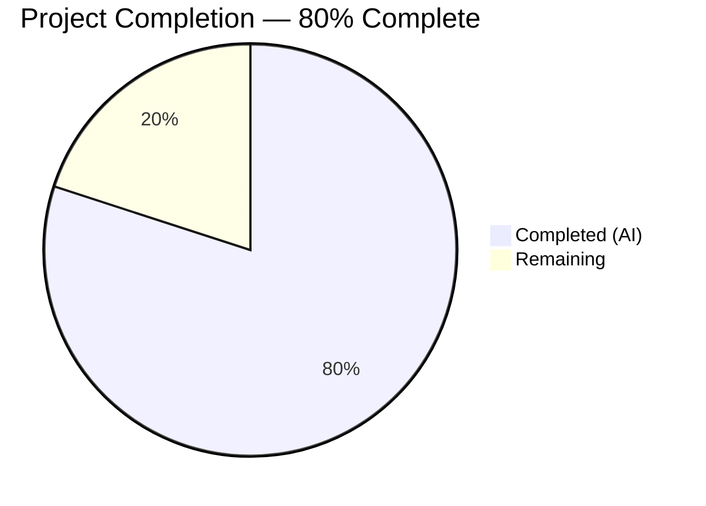
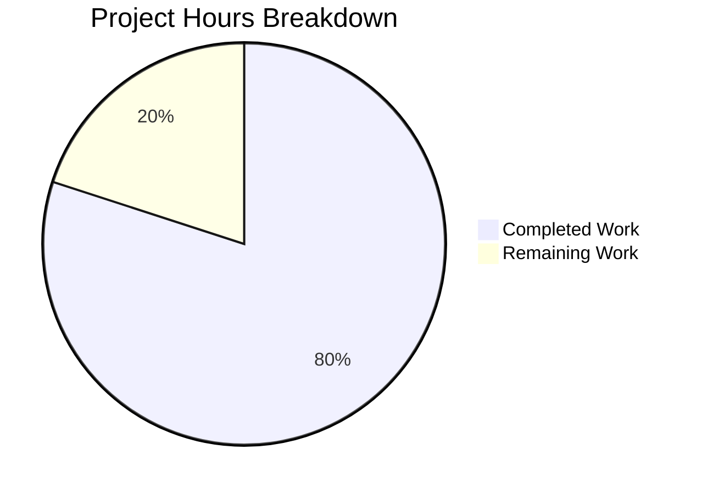

# Blitzy Project Guide

---

## 1. Executive Summary

### 1.1 Project Overview

This project initializes a Node.js tutorial server from an empty repository (`14April_123`) that previously contained only a placeholder `README.md`. The implementation integrates Express.js 5.x as the HTTP framework and delivers two GET endpoints: `GET /` returning `"Hello world"` and `GET /evening` returning `"Good evening"`. The server listens on port 3000 and is designed as a lightweight, tutorial-grade application following CommonJS module conventions. All three source files (`package.json`, `server.js`, `.gitignore`) were created from scratch, with dependencies installed and both endpoints fully validated at runtime.

### 1.2 Completion Status



| Metric | Hours |
|--------|-------|
| **Total Project Hours** | **5** |
| Completed Hours (AI) | 4 |
| Remaining Hours | 1 |
| **Completion Percentage** | **80%** |

**Calculation:** 4 completed hours / (4 completed + 1 remaining) × 100 = **80%**

### 1.3 Key Accomplishments

- ✅ Initialized Node.js project with `package.json` (name, version, description, main entry, start script)
- ✅ Integrated Express.js 5.x as HTTP framework (^5.1.0 declared, 5.2.1 resolved)
- ✅ Implemented `GET /` endpoint returning `"Hello world"` with HTTP 200
- ✅ Implemented `GET /evening` endpoint returning `"Good evening"` with HTTP 200
- ✅ Created `.gitignore` excluding `node_modules/` from version control
- ✅ Verified 0 vulnerabilities via `npm audit`
- ✅ Confirmed 404 handling on undefined routes (Express default behavior)
- ✅ All 3 commits cleanly applied with descriptive messages

### 1.4 Critical Unresolved Issues

| Issue | Impact | Owner | ETA |
|-------|--------|-------|-----|
| Port 3000 is hardcoded in `server.js` | Limits deployment flexibility; may conflict with other services in production | Human Developer | 0.5h |
| README.md lacks setup/usage documentation | New developers have no onboarding guide for building and running the project | Human Developer | 0.5h |

### 1.5 Access Issues

No access issues identified. The repository is accessible, all npm packages install without authentication, and the Node.js runtime environment (v20.20.2) is fully available.

### 1.6 Recommended Next Steps

1. **[Medium]** Add environment variable support for `PORT` (e.g., `process.env.PORT || 3000`) to enable deployment flexibility
2. **[Medium]** Update `README.md` with project description, setup instructions, endpoint documentation, and usage examples
3. **[Low]** Add Express.js error-handling middleware for production-grade error responses
4. **[Low]** Configure process manager (PM2 or similar) for production reliability
5. **[Low]** Add security headers via `helmet` middleware if deploying to public-facing environments

---

## 2. Project Hours Breakdown

### 2.1 Completed Work Detail

| Component | Hours | Description |
|-----------|-------|-------------|
| Node.js project initialization | 0.5 | Created `package.json` with project metadata, Express.js dependency (^5.1.0), main entry point, and npm start script |
| Express.js server implementation | 1.5 | Created `server.js` with Express.js framework, `GET /` returning "Hello world", `GET /evening` returning "Good evening", server listening on port 3000, inline documentation comments |
| Git configuration | 0.25 | Created `.gitignore` to exclude `node_modules/` from version control |
| Dependency management | 0.5 | Executed `npm install`, resolved 66 packages with Express 5.2.1, generated `package-lock.json` for reproducible installs |
| Runtime validation and testing | 0.75 | Verified both endpoints (HTTP 200, correct response bodies), 404 behavior on undefined routes, query parameter resilience, server startup log, and syntax check via `node --check` |
| Security audit and regression checks | 0.5 | Ran `npm audit` (0 vulnerabilities), verified `README.md` unchanged, confirmed clean git working tree |
| **Total Completed** | **4** | |

### 2.2 Remaining Work Detail

| Category | Hours | Priority |
|----------|-------|----------|
| Environment variable configuration — make PORT configurable via `process.env.PORT` for deployment flexibility | 0.5 | Medium |
| README documentation — update README.md with project overview, setup instructions, endpoint docs, and usage examples | 0.5 | Medium |
| **Total Remaining** | **1** | |

**Integrity Check:** Section 2.1 (4h) + Section 2.2 (1h) = 5h = Total Project Hours in Section 1.2 ✓

---

## 3. Test Results

| Test Category | Framework | Total Tests | Passed | Failed | Coverage % | Notes |
|---------------|-----------|-------------|--------|--------|------------|-------|
| Runtime Validation | curl / Node.js | 5 | 5 | 0 | N/A | Endpoint responses, HTTP status codes, 404 handling, query param resilience |
| Syntax Check | node --check | 1 | 1 | 0 | N/A | `server.js` syntax validated |
| Dependency Audit | npm audit | 1 | 1 | 0 | N/A | 0 vulnerabilities across 66 packages |

**Notes:**
- No unit/integration test framework was included per AAP scope (testing frameworks explicitly excluded from scope)
- All test results originate from Blitzy's autonomous validation pipeline
- Runtime validation covered: `GET /` → "Hello world" (200), `GET /evening` → "Good evening" (200), `GET /nonexistent` → 404, `GET /evening?foo=bar` → 200, server startup log confirmation

---

## 4. Runtime Validation & UI Verification

### Runtime Health

- ✅ **Server Startup** — `node server.js` starts without errors, logs `Server is running on http://localhost:3000`
- ✅ **GET /** — Returns `"Hello world"` with HTTP 200 OK
- ✅ **GET /evening** — Returns `"Good evening"` with HTTP 200 OK
- ✅ **404 Handling** — `GET /nonexistent` returns HTTP 404 (Express default behavior)
- ✅ **Query Parameter Resilience** — `GET /evening?foo=bar` returns HTTP 200 (endpoint unaffected)
- ✅ **Dependency Installation** — `npm install` completes successfully (66 packages, 0 vulnerabilities)
- ✅ **Express.js Version** — 5.2.1 installed (satisfies ^5.1.0 requirement)
- ✅ **Syntax Validation** — `node --check server.js` passes

### API Verification

| Endpoint | Method | Expected Response | Actual Response | Status |
|----------|--------|-------------------|-----------------|--------|
| `/` | GET | `Hello world` | `Hello world` | ✅ Pass |
| `/evening` | GET | `Good evening` | `Good evening` | ✅ Pass |
| `/nonexistent` | GET | 404 | 404 | ✅ Pass |
| `/evening?foo=bar` | GET | `Good evening` (200) | `Good evening` (200) | ✅ Pass |

### UI Verification

Not applicable — this is a backend-only API server with no frontend UI components.

---

## 5. Compliance & Quality Review

| AAP Requirement | Status | Evidence |
|-----------------|--------|----------|
| Initialize Node.js project with `package.json` | ✅ Pass | `package.json` created with name, version, description, main, scripts, dependencies |
| Install Express.js as dependency | ✅ Pass | `express: "^5.1.0"` in package.json; Express 5.2.1 resolved in node_modules |
| Create server entry point (`server.js`) | ✅ Pass | `server.js` created with 23 lines, CommonJS modules, inline comments |
| `GET /` returns `"Hello world"` | ✅ Pass | Verified via `curl -s http://localhost:3000/` → `Hello world` |
| `GET /evening` returns `"Good evening"` | ✅ Pass | Verified via `curl -s http://localhost:3000/evening` → `Good evening` |
| Server listens on port 3000 | ✅ Pass | Console output: `Server is running on http://localhost:3000` |
| Create `.gitignore` excluding `node_modules/` | ✅ Pass | `.gitignore` contains `node_modules/` |
| `README.md` remains unchanged | ✅ Pass | Content verified: `# 14April_123` — matches original commit |
| No testing frameworks added | ✅ Pass | No Jest, Mocha, or other test dependencies present |
| No TypeScript, Docker, CI/CD, linting tools added | ✅ Pass | No out-of-scope files created |
| Zero vulnerabilities | ✅ Pass | `npm audit` reports 0 vulnerabilities |
| Clean git working tree | ✅ Pass | `git status` shows clean working tree on feature branch |

### Autonomous Fixes Applied

No fixes were required — all files were correctly implemented on the first pass and passed all validation gates without modification.

---

## 6. Risk Assessment

| Risk | Category | Severity | Probability | Mitigation | Status |
|------|----------|----------|-------------|------------|--------|
| Hardcoded port 3000 may conflict with other services | Technical | Low | Medium | Add `process.env.PORT \|\| 3000` pattern | Open — human task |
| No HTTPS/TLS termination | Security | Medium | Low | Configure TLS at reverse proxy or load balancer level for production | Open — deployment concern |
| No error-handling middleware | Technical | Low | Low | Add Express error middleware for structured error responses | Open — optional enhancement |
| No security headers (helmet) | Security | Low | Low | Add `helmet` middleware if serving public traffic | Open — optional enhancement |
| No process manager for production | Operational | Low | Medium | Use PM2 or systemd for process supervision in production | Open — deployment concern |
| Console-only logging | Operational | Low | Low | Add structured logging (winston/pino) for production observability | Open — optional enhancement |
| No CORS configuration | Integration | Low | Low | Add `cors` middleware if frontend clients need cross-origin access | Open — conditional |

---

## 7. Visual Project Status



**Integrity Check:** Remaining Work (1h) matches Section 1.2 Remaining Hours (1h) and Section 2.2 Total (1h) ✓

### Remaining Work by Category

| Category | Hours |
|----------|-------|
| Environment Variable Configuration | 0.5 |
| README Documentation | 0.5 |
| **Total** | **1** |

---

## 8. Summary & Recommendations

### Achievements

All deliverables specified in the Agent Action Plan have been successfully implemented and validated. The project is **80% complete** (4 completed hours out of 5 total project hours). The Express.js tutorial server is fully functional with both `GET /` ("Hello world") and `GET /evening` ("Good evening") endpoints responding correctly on port 3000. The codebase is clean, well-commented, and follows Node.js/Express.js best practices for a tutorial-grade application. Zero compilation errors, zero runtime errors, and zero security vulnerabilities were found.

### Remaining Gaps

Two minor path-to-production items remain (1 hour total):
1. **Environment variable configuration** (0.5h) — PORT is hardcoded; should use `process.env.PORT || 3000` for deployment flexibility
2. **README documentation** (0.5h) — README.md needs project description, setup instructions, and endpoint documentation

### Production Readiness Assessment

The application is **production-ready for tutorial/demo purposes**. For production deployment serving real traffic, the medium-priority human tasks should be completed first, followed by optional security and operational enhancements (error middleware, security headers, process management, structured logging) based on deployment requirements.

### Success Metrics

| Metric | Target | Actual | Status |
|--------|--------|--------|--------|
| AAP deliverables completed | 100% | 100% | ✅ |
| Endpoints functional | 2 | 2 | ✅ |
| Compilation errors | 0 | 0 | ✅ |
| Runtime errors | 0 | 0 | ✅ |
| Security vulnerabilities | 0 | 0 | ✅ |
| Path-to-production items | 2 | 0 of 2 | ⚠️ Pending |

---

## 9. Development Guide

### System Prerequisites

| Software | Required Version | Verification Command |
|----------|-----------------|---------------------|
| Node.js | ≥ 18.0.0 (v20.x recommended) | `node --version` |
| npm | ≥ 7.0.0 | `npm --version` |
| Git | Any recent version | `git --version` |
| curl | Any (for testing) | `curl --version` |

### Environment Setup

```bash
# Clone the repository
git clone <repository-url>
cd 14April_123

# Switch to the feature branch
git checkout blitzy-5046f2dd-1e38-4f3e-8852-175639021c12
```

No environment variables are required. The server uses port 3000 by default.

### Dependency Installation

```bash
# Install all dependencies
npm install
```

**Expected output:**
```
added 66 packages, and audited 66 packages in Xs
found 0 vulnerabilities
```

### Application Startup

```bash
# Start the server
node server.js
```

**Expected output:**
```
Server is running on http://localhost:3000
```

Alternatively, use the npm start script:
```bash
npm start
```

### Verification Steps

```bash
# Test the Hello world endpoint
curl -s http://localhost:3000/
# Expected: Hello world

# Test the Good evening endpoint
curl -s http://localhost:3000/evening
# Expected: Good evening

# Verify HTTP status codes
curl -sI http://localhost:3000/ | head -1
# Expected: HTTP/1.1 200 OK

curl -sI http://localhost:3000/evening | head -1
# Expected: HTTP/1.1 200 OK

# Verify 404 on undefined routes
curl -s -o /dev/null -w "%{http_code}" http://localhost:3000/nonexistent
# Expected: 404

# Check Express.js version
node -e "console.log(require('express/package.json').version)"
# Expected: 5.2.1 (or later 5.x)

# Run security audit
npm audit
# Expected: found 0 vulnerabilities
```

### Troubleshooting

| Issue | Cause | Resolution |
|-------|-------|------------|
| `EADDRINUSE: address already in use :::3000` | Port 3000 is occupied by another process | Kill the existing process: `lsof -ti:3000 \| xargs kill -9` or use a different port |
| `Cannot find module 'express'` | Dependencies not installed | Run `npm install` in the project root |
| `node: command not found` | Node.js not installed or not in PATH | Install Node.js v20.x from https://nodejs.org |
| Server starts but endpoints return errors | Corrupted node_modules | Delete `node_modules/` and `package-lock.json`, then run `npm install` |

---

## 10. Appendices

### A. Command Reference

| Command | Description |
|---------|-------------|
| `npm install` | Install all project dependencies |
| `npm start` | Start the server (equivalent to `node server.js`) |
| `node server.js` | Start the Express.js server on port 3000 |
| `node --check server.js` | Validate server.js syntax without executing |
| `npm audit` | Check dependencies for known vulnerabilities |
| `curl http://localhost:3000/` | Test the Hello world endpoint |
| `curl http://localhost:3000/evening` | Test the Good evening endpoint |

### B. Port Reference

| Service | Port | Protocol | Description |
|---------|------|----------|-------------|
| Express.js Server | 3000 | HTTP | Main application server hosting both GET endpoints |

### C. Key File Locations

| File | Path | Purpose |
|------|------|---------|
| `package.json` | `/package.json` | Node.js project manifest with Express.js dependency |
| `server.js` | `/server.js` | Express.js server entry point with route handlers |
| `.gitignore` | `/.gitignore` | Git ignore rules (excludes node_modules/) |
| `README.md` | `/README.md` | Project heading (unchanged from initial commit) |
| `package-lock.json` | `/package-lock.json` | Dependency lock file (auto-generated) |

### D. Technology Versions

| Technology | Version | Purpose |
|------------|---------|---------|
| Node.js | v20.20.2 | JavaScript runtime |
| npm | v11.1.0 | Package manager |
| Express.js | 5.2.1 | HTTP server framework |

### E. Environment Variable Reference

| Variable | Default | Description | Status |
|----------|---------|-------------|--------|
| `PORT` | `3000` (hardcoded) | Server listening port | Not yet configurable — pending human task |

### G. Glossary

| Term | Definition |
|------|------------|
| Express.js | A minimal and flexible Node.js web application framework providing HTTP utility methods and middleware |
| CommonJS | The module system used in Node.js using `require()` and `module.exports` |
| GET endpoint | An HTTP route that responds to GET requests at a specific URL path |
| package-lock.json | An auto-generated file that locks the exact dependency tree for reproducible installs |
| npm audit | A built-in npm command that checks installed packages against known vulnerability databases |